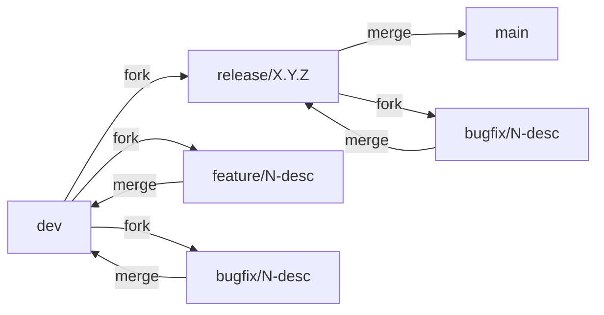
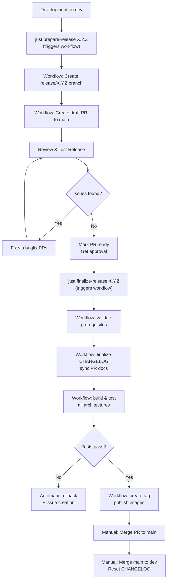

# Release Cycle and Branching Strategy

This document defines the release workflow, branching strategy, and automation for the vigOS devcontainer project.

## Table of Contents

- [Branching Strategy](#branching-strategy)
- [Release Workflow Overview](#release-workflow-overview)
- [Detailed Release Steps](#detailed-release-steps)
- [Scripts and Tools](#scripts-and-tools)
- [CI/CD Integration](#cicd-integration)
- [QMS and Compliance](#qms-and-compliance)
- [Troubleshooting](#troubleshooting)
- [Best Practices](#best-practices)
- [References](#references)

---

## Branching Strategy

### Branch Hierarchy



### Branch Types

| Branch Type | Naming Convention | Purpose | Base Branch | Merge Target |
|-------------|-------------------|---------|-------------|--------------|
| **main** | `main` | Production releases only | N/A | N/A |
| **dev** | `dev` | Integration branch for development | N/A | `main` (via release) |
| **release** | `release/X.Y.Z` | Release preparation and testing (write-protected) | `dev` | `main` |
| **feature** | `feature/N-description` | New features, enhancements | `dev` | `dev`  |
| **bugfix** | `bugfix/N-description` | Bug fixes | `dev` or `release/X.Y.Z` | `dev` or `release/X.Y.Z` |

### Branch Protection Rules

- **main**: Requires PR with approval, all CI checks must pass
- **dev**: Requires PR
- **release/X.Y.Z**: Requires PR

### Topic Branch Naming and Workflow

Topic branches follow the pattern: `<type>/<issue-number>-<short-summary>`

**Branch Types:**

| Type | Use for |
|------|---------|
| **feature** | New functionality, enhancements |
| **bugfix** | Bug fixes (non-urgent) |
| **release** | Release preparation, version bumps, release notes |

**Examples:**
- `feature/48-release-automation`
- `bugfix/52-fix-changelog-parsing`

**Creating a Development Branch:**

When starting work on a GitHub issue:

1. Verify no developer branch is linked yet: `gh issue develop --list <issue_number>`
2. Pick a branch type from: feature, bugfix, release
3. Use a kebab-case short summary from the issue title (a few words, omitting prefixes like "Add")
4. Create and link via GitHub: `gh issue develop <issue_number> --base dev --name <branch_name> --checkout`
5. Ensure local branch is up to date: `git pull origin <branch_name>`

---

## Release Workflow Overview

### Release Lifecycle



### Release Phases

1. **Preparation** (`prepare-release`): Create release branch, prepare CHANGELOG, open draft PR
2. **Review & Testing**: CI validation, mark PR ready, fix issues, get approvals
3. **Finalization** (GitHub Actions workflow): Validate, finalize CHANGELOG, build/test, tag, publish
4. **Post-Release**: Merge to main, merge back to dev, reset CHANGELOG for next cycle


---

## Detailed Release Steps

### Phase 1: Preparation

**Prerequisites:**
- All planned features merged to `dev`
- All tests passing on `dev`
- CHANGELOG Unreleased section has content

**Execute:**

```bash
# Trigger the prepare-release workflow via GitHub Actions
just prepare-release X.Y.Z

# Or directly via GitHub CLI:
gh workflow run prepare-release.yml -f "version=X.Y.Z"
```

**What the workflow does (automatically):**

The `prepare-release.yml` workflow prepares the release branch:

1. ✅ **Validate** job (runs first)
   - Validates semantic version format (X.Y.Z)
   - Verifies release branch `release/X.Y.Z` doesn't exist (local or remote)
   - Verifies tag `vX.Y.Z` doesn't already exist
   - Verifies CHANGELOG has `## Unreleased` section with content
   - Confirms dev branch is checked out

2. ✅ **Prepare** job (skipped if --dry-run)
   - Creates `release/X.Y.Z` branch from `dev`
   - Prepares CHANGELOG using `prepare-changelog.py prepare`
   - Moves Unreleased → `## [X.Y.Z] - TBD`
   - Creates fresh Unreleased section
   - Extracts CHANGELOG content for PR body
   - Commits changes: `chore: prepare release X.Y.Z`
   - Pushes release branch to origin (via GitHub App token, triggering CI)
   - Creates draft PR to `main` with CHANGELOG content as body
   - Outputs PR URL and next steps

**Output example:**

```
✓ Release branch prepared successfully!

Release Summary:
  Version: 1.0.0
  Branch: release/1.0.0

Next steps:
  1. Test release: git checkout release/1.0.0
  2. Review draft PR and monitor CI
  3. Fix any issues via bugfix PRs to release/1.0.0
  4. Mark PR as ready for review (gh pr ready <PR_NUMBER>)
  5. Get PR approval from reviewer
  6. Run: just finalize-release 1.0.0
```

**Key characteristics:**

- **Consistent environment**: Runs on CI runner, not dependent on local tooling
- **Audit trail**: All actions logged in GitHub Actions
- **CI triggering**: Push via GitHub App token triggers CI on release branch automatically
- **No interactive prompts**: Workflow fails if CHANGELOG Unreleased section is missing or empty (no user prompts)
- **Reproducible**: Same behavior regardless of developer's local setup

### Phase 2: Review & Testing

This is the main quality gate. The release branch and draft PR serve as the coordination point.

**Activities:**

1. **Review CHANGELOG**
   - Verify all changes since last release are documented
   - Check issue references are correct
   - Ensure descriptions are clear

2. **CI Testing**

   CI runs automatically on these events:
   - When release branch is created (initial push by `prepare-release`)
   - After each PR merge to the release branch

   Monitor CI status:

   ```bash
   # Check recent CI runs on release branch
   gh run list --branch release/1.0.0 --workflow ci.yml

   # View specific run details
   gh run view <RUN_ID>

   # Watch a running workflow
   gh run watch <RUN_ID>

   # Optional: Manually trigger CI if needed
   gh workflow run ci.yml --ref release/1.0.0
   ```

3. **Mark PR as Ready for Review**

   Once initial CI passes and CHANGELOG is reviewed:

   ```bash
   # Mark PR as ready for review (removes draft status)
   gh pr ready <PR_NUMBER>

   # Or via GitHub UI:
   # Navigate to PR → Click "Ready for review" button
   ```

   This signals to reviewers that the release is ready for formal review.

4. **Local Testing** (optional)

   ```bash
   # Check out release branch
   git checkout release/1.0.0

   # Run tests locally
   just test-all

   # Build container locally (optional)
   ./scripts/build.sh X.Y.Z
   ```

5. **Fix Issues**

   All fixes must go through bugfix branches (release branch is write-protected):

   ```bash
   # Create bugfix branch from release
   git checkout -b bugfix/N-fix-description release/1.0.0

   # Make fixes...
   git add .
   git commit -m "fix: issue description

   Refs: #N"

   # Test locally
   just build
   just test

   # Push and create PR to release branch
   git push origin bugfix/N-fix-description
   gh pr create --base release/1.0.0 --head bugfix/N-fix-description

   # Request review, address feedback
   # After PR is approved and merged:
   # - CI runs automatically on release branch
   # - Monitor: gh run list --branch release/1.0.0

   # Continue testing on release branch
   ```

6. **Request Reviews**
   - Add reviewers to the PR in GitHub UI
   - Address feedback
   - Iterate until approved

**Iteration:** Repeat steps 4-6 until all checks pass and reviewers approve.

### Phase 3: Finalization (GitHub Actions Workflow)

**Prerequisites:**
- All CI checks passed on `release/X.Y.Z`
- PR marked as ready for review (not draft)
- PR has required approvals
- No uncommitted changes

**Execute:**

```bash
# Trigger the finalize-release workflow
just finalize-release X.Y.Z

# Monitor progress
gh run list --workflow release.yml
```

**What the workflow does (automatically):**

The `release.yml` workflow performs the entire remaining release process:

1. ✅ **Validate** job (runs first)
   - Validates semantic version format
   - Checks release branch exists
   - Verifies CHANGELOG has `## [X.Y.Z] - TBD`
   - Verifies tag doesn't already exist
   - Confirms PR exists, is not draft, is approved, and CI passed
   - Records pre-finalization commit for rollback

2. ✅ **Finalize** job (skipped if --dry-run)
   - Sets actual release date in CHANGELOG (TBD → YYYY-MM-DD)
   - Commits: `chore: finalize release X.Y.Z`
   - Pushes release branch
   - Triggers sync-issues workflow to generate PR documentation
   - Waits for sync-issues completion (120s timeout)
   - Pulls PR docs into the release branch

3. ✅ **Build & Test** jobs (per-architecture, runs in parallel)
   - Builds container image as tar file
   - Runs image tests
   - Runs integration tests
   - Uploads tested image as artifact
   - If ANY test fails: entire workflow stops and triggers rollback

4. ✅ **Publish** job (runs only if all builds/tests pass)
   - Creates annotated tag `vX.Y.Z`
   - Pushes tag to origin
   - Downloads tested images from artifacts
   - Logs in to GitHub Container Registry
   - Pushes images to GHCR with architecture-specific tags
   - Creates multi-architecture manifest `ghcr.io/vig-os/devcontainer:X.Y.Z`
   - Creates/updates `ghcr.io/vig-os/devcontainer:latest` manifest (only when both architectures are built)
   - Verifies manifests exist

5. ✅ **Rollback** job (runs if ANY job failed)
   - Resets release branch to pre-finalization state
   - Deletes tag if it was created
   - Creates GitHub issue with failure details for investigation

**Output example:**

```
✓ Release workflow triggered for version 1.0.0
Monitor progress: gh run list --workflow release.yml

[Workflow runs...]

✓ Release published successfully!

Release Summary:
  Version: 1.0.0
  Tag: v1.0.0
  Images:
    - ghcr.io/vig-os/devcontainer:1.0.0
    - ghcr.io/vig-os/devcontainer:latest
```

**Key characteristics:**

- **Earlier validation**: All checks happen at the start in CI
- **Safer workflow**: Tag is created AFTER successful build/test, not before
- **Automatic rollback**: Failed releases are automatically cleaned up
- **Audit trail**: All steps are recorded in GitHub Actions logs with actor information
- **Reproducible**: Uses consistent CI environment, not dependent on local tooling

### Phase 4: Post-Release Cleanup

**Manual steps after workflow completes successfully:**

1. **Merge PR to main**

   ```bash
   # Verify workflow succeeded
   gh run list --workflow release.yml --limit 1

   # Merge PR
   gh pr merge <PR_NUMBER> --merge
   ```

2. **Merge main back to dev**

   ```bash
   git checkout dev
   git pull origin dev
   git merge main
   git push origin dev
   ```

3. **Reset CHANGELOG for next cycle**

   ```bash
   just reset-changelog
   git add CHANGELOG.md
   git commit -m "chore: reset CHANGELOG after release X.Y.Z
   Refs: #N"
   git push origin dev
   ```

**Verify release is published:**

```bash
# List the tag
git tag | grep v1.0.0

# Verify images in registry
docker pull ghcr.io/vig-os/devcontainer:1.0.0
docker pull ghcr.io/vig-os/devcontainer:latest

# Check manifests
docker buildx imagetools inspect ghcr.io/vig-os/devcontainer:1.0.0
```

---

## Scripts and Tools


### prepare-changelog.py

**Location:** `scripts/prepare-changelog.py`

**Purpose:** Multi-action CHANGELOG management tool

**Actions:**

#### `prepare VERSION [FILE]`
Move Unreleased section to version section with TBD date.

```bash
uv run python scripts/prepare-changelog.py prepare 1.0.0 [CHANGELOG.md]
```

#### `validate [FILE]`
Validate CHANGELOG has Unreleased section with content.

```bash
uv run python scripts/prepare-changelog.py validate [CHANGELOG.md]
```

Used by the `prepare-release.yml` workflow to ensure there are changes to release.

#### `reset [FILE]`
Create fresh Unreleased section (for after release merge to dev).

```bash
uv run python scripts/prepare-changelog.py reset [CHANGELOG.md]
```

**Safety:** Fails if Unreleased section already exists (prevents accidental data loss).

#### `finalize VERSION DATE [FILE]`

Replace TBD date with actual release date for a version section.

```bash
uv run python scripts/prepare-changelog.py finalize 1.0.0 2026-02-11 [CHANGELOG.md]
```

Used by the `release.yml` workflow to set the actual release date.

**Tests:** `tests/test_release_cycle.py::TestPrepareChangelog` (22 tests)

### Justfile Recipes

**Location:** `justfile`

**Release-related recipes:**

```bash
# Prepare release branch
just prepare-release X.Y.Z

# Finalize release
just finalize-release X.Y.Z

# Reset CHANGELOG after release
just reset-changelog
```

---

## CI/CD Integration

### Workflow Architecture

The release process uses four coordinated workflows:

#### prepare-release.yml (Release Preparation Workflow)

**Trigger:** `workflow_dispatch` (manual trigger via `just prepare-release X.Y.Z`)

**Purpose:** Create and prepare release branch for testing

**Jobs (sequential):**

1. **validate** - Checks all prerequisites before creating branch
   - Validates semantic version format
   - Verifies release branch does not exist (local or remote)
   - Confirms tag doesn't already exist
   - Verifies CHANGELOG has `## Unreleased` section with content
   - Confirms dev branch is checked out
   - Outputs: version, release_branch

2. **prepare** (skipped if dry-run) - Creates and prepares release branch
   - Creates `release/X.Y.Z` branch from `dev`
   - Prepares CHANGELOG using `prepare-changelog.py prepare`
   - Extracts CHANGELOG content for PR body
   - Creates standardized commit: `chore: prepare release X.Y.Z`
   - Pushes release branch to origin (via GitHub App token to trigger CI)
   - Creates draft PR to `main` with release content
   - Outputs summary and next steps

**Manual trigger (for testing):**

```bash
gh workflow run prepare-release.yml -f "version=1.0.0" -f "dry-run=false"

# Dry-run mode (validates without making changes)
gh workflow run prepare-release.yml -f "version=1.0.0" -f "dry-run=true"
```

**Key characteristics:**
- Provides consistent, reproducible release preparation
- Push via GitHub App token ensures CI runs on new release branch
- Audit trail in GitHub Actions logs
- No dependency on local developer environment

#### release.yml (Unified Release Workflow)

**Trigger:** `workflow_dispatch` (manual trigger via `just finalize-release`)

**Purpose:** Complete release workflow - finalize, build, test, publish, with rollback on failure

**Jobs (sequential):**

1. **validate** - Checks all prerequisites before mutations
   - Validates semantic version format
   - Verifies release branch exists
   - Checks CHANGELOG has `[X.Y.Z] - TBD`
   - Confirms tag doesn't exist
   - Verifies PR: not draft, approved, CI passed
   - Records pre-finalization commit for rollback
   - Outputs: PR number, release date, pre-finalization SHA

2. **finalize** (skipped if dry-run) - Updates release branch
   - Sets release date in CHANGELOG
   - Creates finalization commit
   - Pushes to release branch
   - Triggers sync-issues workflow
   - Waits for sync-issues completion (120s timeout)
   - Outputs: finalization commit SHA

3. **build-and-test** (matrix: amd64, arm64) - Builds and validates images
   - Builds container image for architecture
   - Runs image tests
   - Runs integration tests
   - Uploads tested image as artifact
   - Fails workflow if any test fails

4. **publish** (runs if all builds/tests pass) - Creates tag and publishes
   - Creates annotated tag `vX.Y.Z`
   - Pushes tag
   - Downloads tested images from artifacts
   - Pushes images to GHCR
   - Creates multi-architecture manifests
   - Verifies manifests exist

5. **rollback** (runs if any job failed) - Cleans up partial state
   - Resets release branch to pre-finalization state
   - Deletes tag if it was created
   - Creates GitHub issue with failure details

**Manual trigger (for testing):**

```bash
gh workflow run release.yml \
  -f "version=1.0.0" \
  -f "architectures=amd64,arm64" \
  -f "dry-run=false"

# Dry-run mode (validates without making changes)
gh workflow run release.yml \
  -f "version=1.0.0" \
  -f "dry-run=true"
```

**Key characteristics:**
- Tag created AFTER successful build/test (safer than before)
- Automatic rollback on failure
- All in one workflow for atomic operation
- Audit trail in GitHub Actions logs

#### sync-issues.yml

**Trigger:**
- Scheduled: Daily at midnight UTC
- Manual: `workflow_dispatch`
- Events: Issue/PR creation, update, or closure

**Purpose:** Sync GitHub issues and PRs to markdown files in `.github_data/`

**Usage in release:**
- Automatically triggered by finalize workflow
- Generates PR documentation at release time
- Output files are committed to release branch

**For more details:** See sync-issues workflow documentation

#### ci.yml (CI Workflow)

**Triggers:**
- Pull requests to `dev`, `release/**`, and `main`
- Manual `workflow_dispatch`

**Purpose:** Validate code quality, run tests, check commit messages

**Jobs:**
- Build container image
- Run image tests
- Run integration tests
- Run project checks (linters, CHANGELOG validation, commit message format)

**Note:** CI runs on pull requests to release branches. Combined with the finalize workflow, this provides multiple validation gates:
- PR to release branch: CI validates changes before merge
- finalize workflow: Validates prerequisites before finalization, then rebuilds before publishing


---

## QMS and Compliance

### Traceability

The release process provides traceability for quality management:

- **Configuration Identification:**
  - Version tags (vX.Y.Z) uniquely identify each release
  - CHANGELOG documents all changes with issue references
  - Container image tags correspond to git tags

- **Change Control:**
  - All changes tracked via GitHub issues
  - Issue references in commits (`Refs: #N`)
  - PR documentation synced to repository
  - Traceability from requirement → implementation → test

- **Release Archive:**
  - Git tags mark approved releases
  - CHANGELOG provides change history
  - Container images published to GHCR
  - PR documentation in `.github_data/pull-requests/`

### QMS Documentation

QMS documentation (baselines, configuration management records, etc.) is managed separately by the organization-wide QMS repository.

The release process provides the necessary artifacts for QMS documentation:
- Release tags with complete source code
- CHANGELOG with all changes
- PR documentation with review evidence
- Published container images with digests
- Commit history with issue traceability

---

## Troubleshooting

### Common Issues

#### "CHANGELOG validation failed" (in validate job)

**Cause:** No Unreleased section or it's empty in CHANGELOG.md

**Solution:**

```bash
# Add changes to CHANGELOG Unreleased section
vim CHANGELOG.md

# Verify locally
uv run python scripts/prepare-changelog.py validate CHANGELOG.md
```

#### "Release branch not found"

**Cause:** You need to run `just prepare-release X.Y.Z` first

**Solution:**

```bash
# Create the release branch
just prepare-release X.Y.Z

# Review and test the release
git checkout release/X.Y.Z

# Then trigger finalization
just finalize-release X.Y.Z
```

#### "PR is still in draft status"

**Cause:** Release PR hasn't been marked as ready for review

**Solution:**

```bash
# Mark PR as ready
gh pr ready <PR_NUMBER>

# Or manually via GitHub UI
# Navigate to PR → Click "Ready for review" button
```

#### "PR has not been approved"

**Cause:** PR needs at least one approval

**Solution:**

```bash
# Add reviewers to the PR
gh pr edit <PR_NUMBER> --add-reviewer <USERNAME>

# Wait for approval
```

#### "CI checks have failed"

**Cause:** Tests failed on the release branch

**Solution:**

```bash
# Check CI status
gh pr checks <PR_NUMBER>

# View workflow details
gh run list --branch release/X.Y.Z

# Fix issues via bugfix branches
git checkout -b bugfix/N-fix-description release/X.Y.Z
# make fixes...
git push origin bugfix/N-fix-description
gh pr create --base release/X.Y.Z --head bugfix/N-fix-description
```

#### "Release workflow failed - automatic rollback created"

**Cause:** Build, test, or publish job failed during the workflow

**Solution:**

```bash
# Review the failure
gh run list --workflow release.yml --limit 1
gh run view <RUN_ID> --log

# Check the automatic rollback issue
gh issue list --label release

# Fix the issue on the release branch
git checkout release/X.Y.Z
git pull origin release/X.Y.Z
# make fixes...
git push origin release/X.Y.Z

# Re-run the workflow
just finalize-release X.Y.Z
```

#### "Sync-issues workflow timed out"

**Cause:** sync-issues didn't complete within 120 seconds

**Solution:**

```bash
# Check sync-issues status
gh run list --workflow sync-issues.yml --limit 1
gh run view <RUN_ID>

# If it completed successfully, the next finalize-release attempt should work
# If it failed, check the sync-issues workflow logs and fix the issue
```

#### "Tag already exists"

**Cause:** A previous release attempt didn't clean up the tag

**Solution:**

```bash
# Delete the old tag
git push origin :refs/tags/v<VERSION>

# Try again
just finalize-release <VERSION>
```

### Recovery Procedures

#### Abort Release After prepare-release

```bash
# Delete release branch
git push origin --delete release/X.Y.Z
git branch -D release/X.Y.Z

# Close PR
gh pr close <PR_NUMBER>
```

#### If Release Workflow Fails (Automatic Rollback)

The workflow automatically performs rollback on failure:

```bash
# 1. Check the failure
gh run list --workflow release.yml --limit 1
gh run view <RUN_ID> --log

# 2. Find the created issue
gh issue list --label release

# 3. Examine what was rolled back (issue will document this)
# The workflow automatically:
#   - Reset release branch to pre-finalization state
#   - Deleted any tag that was created
#   - Created this issue for investigation

# 4. Fix the underlying issue on the release branch
git checkout release/X.Y.Z
git pull origin release/X.Y.Z

# Make necessary fixes...
git add .
git commit -m "fix: address release issue

Refs: #<ISSUE_NUMBER>"
git push origin release/X.Y.Z

# 5. Re-run the workflow
just finalize-release X.Y.Z
```

#### Manual Rollback (If Needed)

In rare cases where the automatic rollback didn't work:

```bash
# Reset release branch to pre-finalization state
PRE_SHA="<pre_finalize_sha>"  # From workflow logs
git fetch origin
git checkout release/X.Y.Z
git reset --hard $PRE_SHA
git push --force-with-lease origin release/X.Y.Z

# Delete tag if it exists
git push origin :refs/tags/vX.Y.Z

# Fix the issue and re-run workflow
just finalize-release X.Y.Z
```

---

## Best Practices

### Release Timing

- **Feature Freeze:** Stop merging features to dev ~1 week before release
- **Bug Fix Only:** Only critical fixes on release branch
- **Release Date:** Set when actually releasing (in finalize-release)

### Version Numbering

Follow [Semantic Versioning 2.0.0](https://semver.org/):

- **MAJOR (X.0.0):** Breaking changes, incompatible API changes
- **MINOR (X.Y.0):** New features, backward-compatible
- **PATCH (X.Y.Z):** Bug fixes, backward-compatible

### CHANGELOG Maintenance

- Update during development, not at release time
- Each feature/fix PR should update CHANGELOG
- Use clear, user-facing language
- Include issue references: `([#N](link))`
- Group by type: Added, Changed, Fixed, Removed, etc.

### Communication

- Announce release preparation in team channels
- Share PR URL for review
- Notify when release is published
- Document any known issues or migration notes

---

## References

- [CHANGELOG Format](../CHANGELOG.md) - Keep a Changelog standard
- [Commit Message Standard](COMMIT_MESSAGE_STANDARD.md) - Commit format and validation
- [Branch Naming Rules](../.cursor/rules/branch-naming.mdc) - Topic branch conventions
- [IEC 62304](https://www.iso.org/standard/38421.html) - Medical device software lifecycle
- [Semantic Versioning](https://semver.org/) - Version numbering scheme
