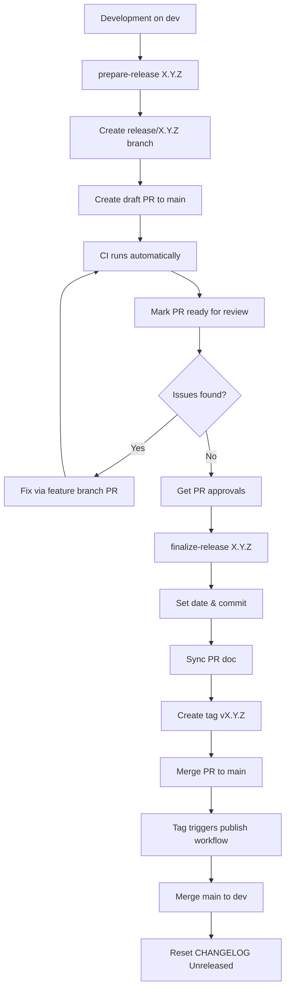

# Release Cycle and Branching Strategy

This document defines the release workflow, branching strategy, and automation for the vigOS devcontainer project.

## Table of Contents

- [Branching Strategy](#branching-strategy)
- [Release Workflow Overview](#release-workflow-overview)
- [Detailed Release Steps](#detailed-release-steps)
- [Scripts and Tools](#scripts-and-tools)
- [CI/CD Integration](#cicd-integration)
- [QMS and Compliance](#qms-and-compliance)
- [Troubleshooting](#troubleshooting)

---

## Branching Strategy

### Branch Hierarchy

```
main          Production releases (tagged)
  ↑
  └─ release/X.Y.Z    Release preparation and testing (write-protected)
       ↑             └─ bugfix/N-description   Fixes during release
       |
       └─ dev         Main development branch (default)
            ↑
            └─ feature/N-description   Feature development
            └─ bugfix/N-description    Bug fixes
```

### Branch Types

| Branch Type | Naming Convention | Purpose | Base Branch | Merge Target |
|-------------|-------------------|---------|-------------|--------------|
| **main** | `main` | Production releases only | N/A | N/A |
| **dev** | `dev` | Integration branch for development | N/A | `main` (via release) |
| **release** | `release/X.Y.Z` | Release preparation and testing (write-protected) | `dev` | `main` |
| **feature** | `feature/N-description` | New features, enhancements | `dev` | `dev`  |
| **bugfix** | `bugfix/N-description` | Bug fixes | `dev` or `release/X.Y.Z` | `dev` or `release/X.Y.Z` |

### Branch Protection Rules

- **main**: Requires PR with two approvals, all CI checks must pass
- **dev**: Requires PR with one approval
- **release/X.Y.Z**: Requires PR with one approval

### Topic Branch Naming

Topic branches (feature/bugfix/hotfix) follow the pattern: `<type>/<issue-number>-<short-summary>`

**Examples:**
- `feature/48-release-automation`
- `bugfix/52-fix-changelog-parsing`

See [.cursor/rules/branch-naming.mdc](.cursor/rules/branch-naming.mdc) for the complete branching workflow including GitHub issue integration.

---

## Release Workflow Overview

### Release Lifecycle



### Release Phases

1. **Preparation** (`prepare-release`): Create release branch, prepare CHANGELOG, open draft PR
2. **Review & Testing**: CI validation, mark PR ready, fix issues, get approvals
3. **Finalization** (`finalize-release`): Set release date, sync PR doc, create tag
4. **Publication**: Merge to main, trigger container image publication
5. **Post-Release**: Merge back to dev, reset CHANGELOG for next cycle

---

## Detailed Release Steps

### Phase 1: Preparation

**Prerequisites:**
- All planned features merged to `dev`
- All tests passing on `dev`
- CHANGELOG Unreleased section has content

**Execute:**

```bash
# Ensure you're on dev and up to date
git checkout dev
git pull origin dev

# Prepare the release
just prepare-release X.Y.Z

# Or directly:
./scripts/prepare-release.sh X.Y.Z
```

**What happens:**
1. ✅ Validates semantic version format (X.Y.Z)
2. ✅ Checks you're on `dev` branch
3. ✅ Verifies no uncommitted changes
4. ✅ Validates CHANGELOG has Unreleased content
5. ✅ Creates `release/X.Y.Z` branch from `dev`
6. ✅ Updates CHANGELOG:
   - Moves Unreleased → `## [X.Y.Z] - TBD`
   - Creates fresh Unreleased section
7. ✅ Commits changes: `chore: prepare release X.Y.Z`
8. ✅ Pushes release branch to origin
9. ✅ Creates draft PR to `main` with CHANGELOG content as body
10. ✅ Outputs PR URL for tracking

**Output example:**

```
✓ Created release branch: release/1.0.0
✓ Updated CHANGELOG.md
✓ Pushed branch to origin
✓ Created draft PR #123 to main

Next steps:
  1. Review PR: https://github.com/vig-os/devcontainer/pull/123
  2. Monitor CI (runs automatically): gh run list --branch release/1.0.0
  3. Fix any issues via feature branch PRs to release/1.0.0
  4. When ready: just finalize-release 1.0.0
```

### Phase 2: Review & Testing

This is the main quality gate. The release branch and draft PR serve as the coordination point.

**Activities:**

1. **Review CHANGELOG**
   - Verify all changes since last release are documented
   - Check issue references are correct
   - Ensure descriptions are clear

2. **CI Testing**

   CI runs automatically on these events:
   - When release branch is created (initial push by `prepare-release`)
   - After each PR merge to the release branch

   Monitor CI status:

   ```bash
   # Check recent CI runs on release branch
   gh run list --branch release/1.0.0 --workflow ci.yml

   # View specific run details
   gh run view <RUN_ID>

   # Watch a running workflow
   gh run watch <RUN_ID>

   # Optional: Manually trigger CI if needed
   gh workflow run ci.yml --ref release/1.0.0
   ```

3. **Mark PR as Ready for Review**

   Once initial CI passes and CHANGELOG is reviewed:

   ```bash
   # Mark PR as ready for review (removes draft status)
   gh pr ready <PR_NUMBER>

   # Or via GitHub UI:
   # Navigate to PR → Click "Ready for review" button
   ```

   This signals to reviewers that the release is ready for formal review.

4. **Local Testing** (optional)

   ```bash
   # Check out release branch
   git checkout release/1.0.0

   # Run tests locally
   just test-all

   # Build container locally (optional)
   ./scripts/prepare-build.sh X.Y.Z build TBD "https://github.com/vig-os/devcontainer/releases/tag/vX.Y.Z"
   docker build -t test:X.Y.Z ./build
   ```

5. **Fix Issues**

   All fixes must go through feature branches (release branch is write-protected):

   ```bash
   # Create feature branch from release
   git checkout -b fix/N-fix-description release/1.0.0

   # Make fixes...
   git add .
   git commit -m "fix: issue description

   Refs: #N"

   # Test locally
   just build
   just test

   # Push and create PR to release branch
   git push origin feature/N-fix-description
   gh pr create --base release/1.0.0 --head feature/N-fix-description

   # Request review, address feedback
   # After PR is approved and merged:
   # - CI runs automatically on release branch
   # - Monitor: gh run list --branch release/1.0.0

   # Continue testing on release branch
   ```

6. **Request Reviews**
   - Add reviewers to the PR in GitHub UI
   - Address feedback
   - Iterate until approved

**Iteration:** Repeat steps 4-6 until all checks pass and reviewers approve.

### Phase 3: Finalization

**Prerequisites:**
- All CI checks passed on `release/X.Y.Z`
- PR marked as ready for review (not draft)
- All PR reviews approved
- Ready to create release tag and merge

**Execute:**

```bash
# Ensure you're on the release branch
git checkout release/X.Y.Z

# Finalize the release
just finalize-release X.Y.Z

# Or directly:
./scripts/finalize-release.sh X.Y.Z
```

**What happens:**
1. ✅ Verifies you're on correct release branch
2. ✅ Checks for uncommitted changes
3. ✅ Verifies CI checks passed on release branch
4. ✅ Verifies PR is not in draft (ready for review)
5. ✅ Verifies PR has required approvals
6. ✅ Sets actual release date in CHANGELOG (TBD → YYYY-MM-DD)
7. ✅ Commits changes: `chore: finalize release X.Y.Z`
8. ✅ Triggers sync-issues workflow to generate PR doc
9. ✅ Waits for sync-issues completion
10. ✅ Pulls PR doc changes
11. ✅ Creates annotated tag `vX.Y.Z`
12. ✅ Pushes tag to origin
13. ✅ Outputs merge instructions

**Important:** The tag `vX.Y.Z` points to a commit that includes:
- Final CHANGELOG with actual release date
- Generated PR documentation
- All release content

**Output example:**

```
✓ Verified CI checks passed
✓ Verified PR #123 is ready and approved
✓ Set release date: 2026-02-06
✓ Committed finalization changes
✓ Triggered sync-issues workflow
✓ Waiting for PR doc generation...
✓ PR doc synced: .github_data/pull-requests/pr-123.md
✓ Created tag: v1.0.0
✓ Pushed tag to origin

Next steps:
  1. Merge PR #123: https://github.com/vig-os/devcontainer/pull/123
  2. Tag v1.0.0 will trigger release workflow automatically
  3. Monitor release: gh run list --workflow release.yml
```

### Phase 4: Publication

**Execute in GitHub UI:**

1. Navigate to the PR
2. Verify all checks passed
3. Click "Merge pull request"
4. Confirm merge

**What happens automatically:**

1. ✅ PR merged to `main`
2. ✅ Tag `vX.Y.Z` triggers `release.yml` workflow
3. ✅ Workflow builds multi-architecture container images
4. ✅ Runs container tests
5. ✅ Publishes to GitHub Container Registry
6. ✅ Creates multi-arch manifests
7. ✅ Updates `latest` tag

**Monitor publication:**

```bash
# Watch the release workflow
gh run list --workflow release.yml

# View specific run
gh run view <RUN_ID>

# Verify image published
docker pull ghcr.io/vig-os/devcontainer:X.Y.Z
docker pull ghcr.io/vig-os/devcontainer:latest
```

### Phase 5: Post-Release Cleanup

**Execute:**

```bash
# Merge main back to dev
git checkout dev
git pull origin dev
git merge main
git push origin dev

# Reset CHANGELOG Unreleased section
just reset-changelog

# Commit the reset
git add CHANGELOG.md
git commit -m "chore: reset CHANGELOG after release X.Y.Z

Refs: #N"
git push origin dev

# Optional: Delete local release branch
git branch -d release/X.Y.Z
```

**What this achieves:**
- `dev` gets all changes from `main` (including any last-minute fixes)
- CHANGELOG Unreleased section recreated with all standard subsections
- Ready for next development cycle

**Note:** The release branch `release/X.Y.Z` remains on the remote for reference and future hotfixes.

---

## Scripts and Tools

### prepare-release.sh

**Location:** `scripts/prepare-release.sh`

**Purpose:** Create and prepare a release branch

**Usage:**

```bash
./scripts/prepare-release.sh X.Y.Z [--dry-run]
```

**Options:**
- `--dry-run`: Preview actions without making changes

**Exit codes:**
- `0`: Success
- `1`: Validation error or failure

**Tests:** `tests/test_release_cycle.py::TestPrepareReleaseScript` (11 tests)

### finalize-release.sh

**Location:** `scripts/finalize-release.sh`

**Purpose:** Finalize release, create tag, prepare for merge

**Usage:**

```bash
./scripts/finalize-release.sh X.Y.Z [--dry-run]
```

**Options:**
- `--dry-run`: Show what would be done without executing

**Prerequisites:**
- Must be on `release/X.Y.Z` branch
- CI checks should have passed
- PR should be reviewed and approved
- GitHub CLI (`gh`) and origin remote must be configured

**Exit codes:**
- `0`: Success
- `1`: Validation error or failure

### prepare-changelog.py

**Location:** `scripts/prepare-changelog.py`

**Purpose:** Multi-action CHANGELOG management tool

**Actions:**

#### `prepare VERSION [FILE]`
Move Unreleased section to version section with TBD date.

```bash
uv run python scripts/prepare-changelog.py prepare 1.0.0 [CHANGELOG.md]
```

#### `validate [FILE]`
Validate CHANGELOG has Unreleased section with content.

```bash
uv run python scripts/prepare-changelog.py validate [CHANGELOG.md]
```

Used by `prepare-release.sh` to ensure there are changes to release.

#### `reset [FILE]`
Create fresh Unreleased section (for after release merge to dev).

```bash
uv run python scripts/prepare-changelog.py reset [CHANGELOG.md]
```

**Safety:** Fails if Unreleased section already exists (prevents accidental data loss).

#### `extract-pr VERSION [FILE]` *(planned)*
Extract version section for PR body generation.

```bash
uv run python scripts/prepare-changelog.py extract-pr 1.0.0 [CHANGELOG.md]
```

**Tests:** `tests/test_release_cycle.py::TestPrepareChangelog` (22 tests)

### Justfile Recipes

**Location:** `justfile`

**Release-related recipes:**

```bash
# Prepare release branch
just prepare-release X.Y.Z

# Finalize release (planned)
just finalize-release X.Y.Z

# Reset CHANGELOG after release
just reset-changelog
```

---

## CI/CD Integration

### Current Workflows

#### release.yml

**Trigger:** Push to tags matching `v[0-9]+.[0-9]+.[0-9]+`

**Purpose:** Build, test, and publish multi-architecture container images

**Process:**
1. Extract version from tag
2. Build amd64 and arm64 images in parallel
3. Run container tests on each architecture
4. Push images to GHCR
5. Create multi-arch manifests
6. Update `latest` tag

**Manual trigger:**

```bash
gh workflow run release.yml \
  -f version=1.0.0-test \
  -f publish=false \
  -f architectures=amd64
```

#### sync-issues.yml

**Trigger:**
- Issue/PR events
- Manual `workflow_dispatch`

**Purpose:** Sync GitHub issues and PRs to markdown files

**Configuration for releases:**

```yaml
on:
  push:
    branches:
      - dev
      - 'release/**'  # Enabled for release branches
      # NOT main - explicitly excluded
```

**Manual trigger:**

```bash
gh workflow run sync-issues.yml --ref release/X.Y.Z
```

#### ci.yml

**Triggers:**
- Push to `dev` and `release/**` branches (runs after merges)
- Pull requests to `dev`, `release/**`, and `main`
- Manual `workflow_dispatch`

**Purpose:** Run automated tests and linters

**Configuration:**

```yaml
on:
  push:
    branches:
      - dev
      - 'release/**'
  pull_request:
    branches:
      - dev
      - 'release/**'
      - main
  workflow_dispatch:
```

**Jobs:**
- Run pytest test suite
- Run linters (ruff, pre-commit)
- Validate CHANGELOG format
- Check commit message format

**Why both push and PR triggers?**
- **PR trigger:** Validates changes before merge (gate)
- **Push trigger:** Runs after merge to detect integration issues

**Manual trigger (optional):**

```bash
gh workflow run ci.yml --ref release/X.Y.Z
```

---

## QMS and Compliance

### Traceability

The release process provides traceability for quality management:

- **Configuration Identification:**
  - Version tags (vX.Y.Z) uniquely identify each release
  - CHANGELOG documents all changes with issue references
  - Container image tags correspond to git tags

- **Change Control:**
  - All changes tracked via GitHub issues
  - Issue references in commits (`Refs: #N`)
  - PR documentation synced to repository
  - Traceability from requirement → implementation → test

- **Release Archive:**
  - Git tags mark approved releases
  - CHANGELOG provides change history
  - Container images published to GHCR
  - PR documentation in `.github_data/pull-requests/`

### QMS Documentation

QMS documentation (baselines, configuration management records, etc.) is managed separately by the organization-wide QMS repository.

The release process provides the necessary artifacts for QMS documentation:
- Release tags with complete source code
- CHANGELOG with all changes
- PR documentation with review evidence
- Published container images with digests
- Commit history with issue traceability

---

## Troubleshooting

### Common Issues

#### "CHANGELOG validation failed"

**Cause:** No Unreleased section or it's empty

**Solution:**

```bash
# Add changes to CHANGELOG Unreleased section
vim CHANGELOG.md

# Verify
uv run python scripts/prepare-changelog.py validate CHANGELOG.md
```

#### "Release branch already exists"

**Cause:** Previous release attempt wasn't completed or cleaned up

**Solution:**

```bash
# Check existing release branches
git branch -r | grep release/

# Delete old release branch if safe
git push origin --delete release/X.Y.Z
git branch -D release/X.Y.Z
```

#### "Not up to date with origin/dev"

**Cause:** Local dev branch is behind remote

**Solution:**

```bash
git checkout dev
git pull origin dev
```

#### "Sync-issues timeout"

**Cause:** Workflow took longer than expected or failed

**Solution:**

```bash
# Check workflow status
gh run list --workflow sync-issues.yml --branch release/X.Y.Z

# View specific run
gh run view <RUN_ID>

# Re-trigger if needed
gh workflow run sync-issues.yml --ref release/X.Y.Z
```

#### "Container publish failed"

**Cause:** Tests failed or registry authentication issue

**Solution:**

```bash
# Check release workflow
gh run list --workflow release.yml

# View logs
gh run view <RUN_ID> --log

# Re-run if transient failure
gh run rerun <RUN_ID>
```

### Recovery Procedures

#### Abort Release After prepare-release

```bash
# Delete release branch
git push origin --delete release/X.Y.Z
git branch -D release/X.Y.Z

# Close PR
gh pr close <PR_NUMBER>
```

#### Fix Issues After finalize-release

If tag was created but something went wrong:

```bash
# Delete tag locally and remotely
git tag -d vX.Y.Z
git push origin :refs/tags/vX.Y.Z

# Fix issues on release branch
git checkout release/X.Y.Z
# Make fixes...
git push origin release/X.Y.Z

# Re-run finalize-release
./scripts/finalize-release.sh X.Y.Z
```

#### Roll Back Published Release

**Caution:** Only for critical issues. Published images are immutable.

```bash
# Create hotfix branch from previous tag
git checkout -b hotfix/X.Y.Z-1 vX.Y.Z-1

# Apply fix
# ...

# Follow hotfix release process
```

---

## Best Practices

### Release Timing

- **Feature Freeze:** Stop merging features to dev ~1 week before release
- **Bug Fix Only:** Only critical fixes on release branch
- **Release Date:** Set when actually releasing (in finalize-release)

### Version Numbering

Follow [Semantic Versioning 2.0.0](https://semver.org/):

- **MAJOR (X.0.0):** Breaking changes, incompatible API changes
- **MINOR (X.Y.0):** New features, backward-compatible
- **PATCH (X.Y.Z):** Bug fixes, backward-compatible

### CHANGELOG Maintenance

- Update during development, not at release time
- Each feature/fix PR should update CHANGELOG
- Use clear, user-facing language
- Include issue references: `([#N](link))`
- Group by type: Added, Changed, Fixed, Removed, etc.

### Communication

- Announce release preparation in team channels
- Share PR URL for review
- Notify when release is published
- Document any known issues or migration notes

---

## References

- [CHANGELOG Format](../CHANGELOG.md) - Keep a Changelog standard
- [Commit Message Standard](COMMIT_MESSAGE_STANDARD.md) - Commit format and validation
- [Branch Naming Rules](../.cursor/rules/branch-naming.mdc) - Topic branch conventions
- [IEC 62304](https://www.iso.org/standard/38421.html) - Medical device software lifecycle
- [Semantic Versioning](https://semver.org/) - Version numbering scheme

---

## Document History

| Version | Date | Author | Changes |
|---------|------|--------|---------|
| 1.0.0 | 2026-02-06 | Carlos Vigo | Initial documentation of release cycle and branching strategy |
