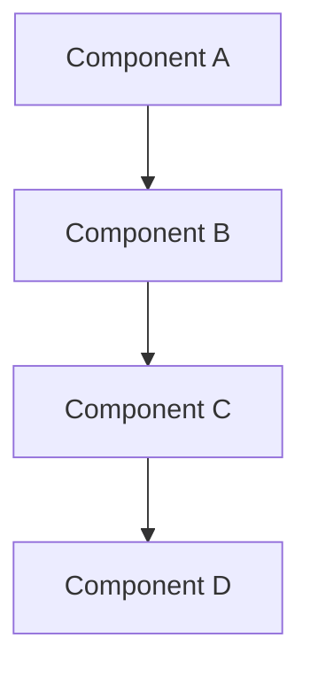

# DES-<number>: <Title>

## Overview

Brief summary of what this design covers and its relationship to the RFC.
- **Purpose**: What problem does this solve?
- **Scope**: What's in/out of scope for this design?
- **Related RFC**: RFC-<number> - <title>

## Architecture

High-level architecture and major design decisions.

### System Context

How does this fit into the larger system? What are the boundaries?

```
[Optional: System context diagram]
```

### Key Decisions

- **Decision 1**: Description and rationale
- **Decision 2**: Description and rationale

## Components

### Component 1: <Name>

**Responsibility**: What does it do?

**Interface**: How do other components interact with it?

**Implementation notes**: Key details about how it works

### Component 2: <Name>

...

## Data Flow

Describe how data moves through the system.

```
[Optional: Sequence diagram or data flow diagram]
```

### Happy Path

1. Step 1: What happens
2. Step 2: What happens
3. ...

### Error Paths

- **Error scenario 1**: How it's handled
- **Error scenario 2**: How it's handled

## Component Topology

Visual representation of components and their relationships.



## Technology Stack

### Languages & Frameworks

- **Language**: Version, rationale
- **Framework**: Version, rationale

### Build vs Buy

- **Library/Service 1**: Build/Buy decision and rationale
- **Library/Service 2**: Build/Buy decision and rationale

## Testing Strategy

### Unit Testing

- What will be unit tested?
- Coverage expectations?

### Integration Testing

- What integration points need testing?
- Test scenarios?

### End-to-End Testing

- What user journeys need E2E coverage?
- Test data requirements?

## Security Considerations

- Authentication/Authorization requirements
- Data protection needs
- Known vulnerabilities to mitigate
- Security testing approach

## Performance Considerations

- Expected load/scale
- Performance targets (latency, throughput)
- Bottlenecks and mitigation strategies
- Monitoring and observability

## Error Handling

- Error detection strategy
- Error recovery approach
- Logging and alerting
- User-facing error messages

## Deployment

- Deployment model (container, serverless, etc.)
- Configuration management
- Rollout strategy (blue/green, canary, etc.)
- Rollback plan

## Monitoring & Observability

- Key metrics to track
- Logging strategy
- Alerting thresholds
- Debugging approach

## Open Questions

- Question 1?
- Question 2?

## References

- Related designs: DES-<number>
- Pattern references: Links to system design patterns used
- Documentation: Relevant API docs, specs, standards
